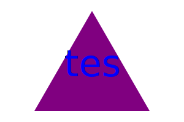

# Challenge-10-SVG-Maker-
# SVG Maker

This repository contains the code for an SVG maker. With this tool, you can easily create and manipulate SVG (Scalable Vector Graphics) files.

## Features

- Create basic shapes such as rectangles, circles, and lines.
- Customize the appearance of shapes with different colors, stroke widths, and fill patterns.
- Group shapes together to create complex compositions.
- Export SVG files to use in web development or graphic design projects.

## Getting Started

To get started with the SVG maker, follow these steps:

1. Clone the repository to your local machine.
2. Open the SVG maker application.
3. Use the provided tools and options to create and modify SVG shapes.
4. Save your SVG file and use it in your projects.

## Usage Examples

Here are a few examples of how you can use the SVG maker:
](examples/KaiExample.svg)

](examples/newSquare.svg)

## Walk-Through Video
https://drive.google.com/file/d/1JFuoginPagD_fmAb57fjBh5K9gcsvDbH/view